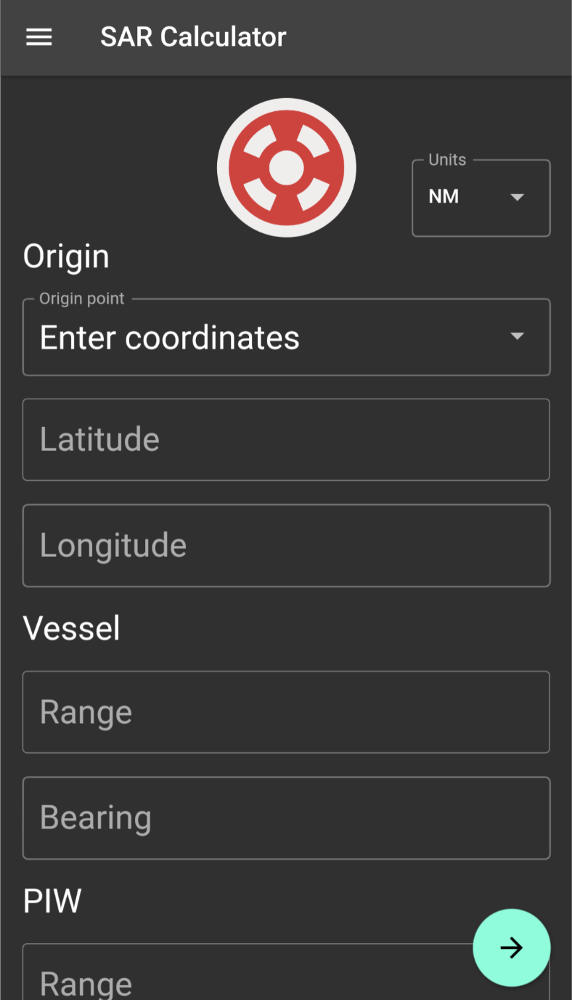

# bearing_range

Given bearing and range to vessel and PIW, calculate bearing and range from vessel to PIW and show a map. 

[Web app version here.](https://molly.ngaretou.com)

  
   
  <i>Screenshot of bearing_range</i>

